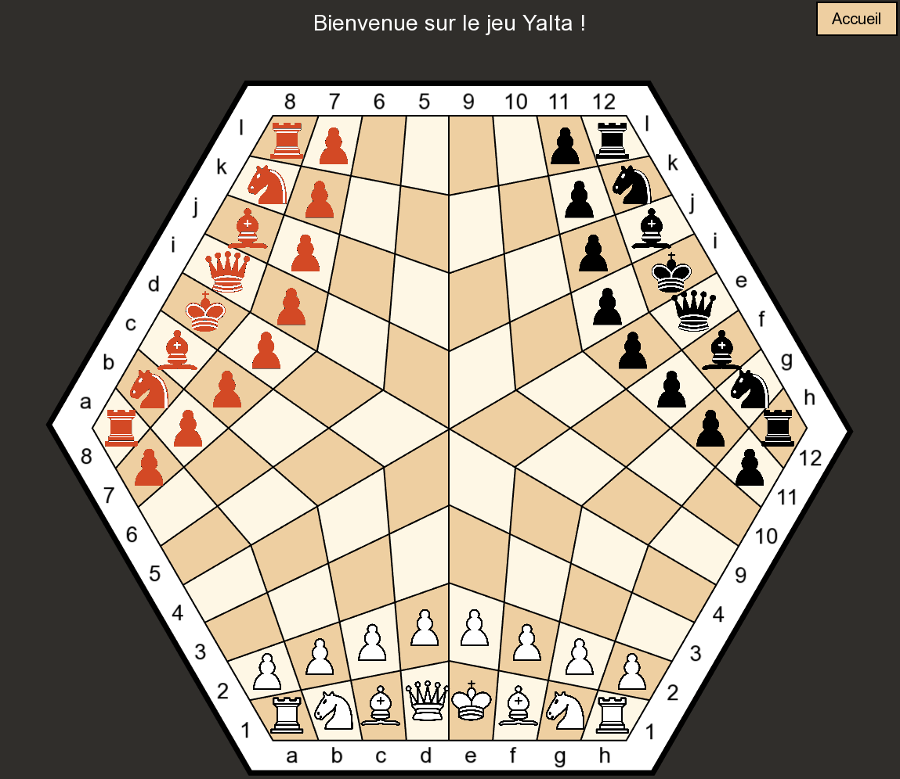

# Échecs Yalta 

Les échecs Yalta constituent une variante de jeu d'échecs permettant de jouer à trois joueurs. Chaque joueur contrôle une armée (blanche, rouge ou noire) sur un plateau hexagonal.

## Description du Jeu

Le jeu se déroule sur un plateau hexagonal divisé en 6 sections. Chaque joueur commence avec 16 pièces traditionnelles (8 pions, 2 tours, 2 cavaliers, 2 fous, 1 reine et 1 roi) disposées sur deux rangées.



### Règles Spéciales
- Le plateau est divisé en 6 sections hexagonales
- Une zone centrale spéciale (rosace) avec des règles de capture particulières
- Les pièces peuvent se déplacer entre les sections via des points de connexion
- Chaque joueur joue à tour de rôle dans l'ordre : Blanc → Rouge → Noir

## Prérequis

- C++17 ou supérieur
- SFML (Simple and Fast Multimedia Library)
- Make
- G++

## Installation

1. Clonez le dépôt :
```bash
git clone https://github.com/YliesChementel/Echec_Yalta.git
cd Echec_Yalta
```

2. Installez les dépendances SFML :
```bash
# Sur Ubuntu/Debian
sudo apt-get update
sudo apt-get install libsfml-dev=2.5.1+dfsg-1build1
```

3. Compilez le projet :
```bash
cd MVC
make
```

## Démarrage

1. Lancez le jeu :
```bash
./YaltaEchec
```

2. Dans le menu principal, vous pouvez :
   - Choisir quels joueurs seront contrôlés par l'IA (Il est possible que l'IA prenne du temps pour jouer son coup.)
   - Activer le mode debug (optionnel)
   - Lancer une nouvelle partie
   - Quitter le jeu

## Contrôles

- Clic gauche : Sélectionner/déplacer une pièce
- Échap : Retour au menu principal

## Mode Debug

Le mode Debug peut être activé depuis le menu principal. Il permet de déplacer les pièces sur le plateau sans tenir compte du tour, ce qui est utile pour tester les mouvements des différentes pièces sur le plateau hexagonale.

## Structure du Projet

Le projet suit une architecture MVC (Modèle-Vue-Contrôleur) :
- `Model/` : Logique du jeu et règles
- `View/` : Interface graphique et rendu
- `Controller/` : Gestion des interactions et des états
